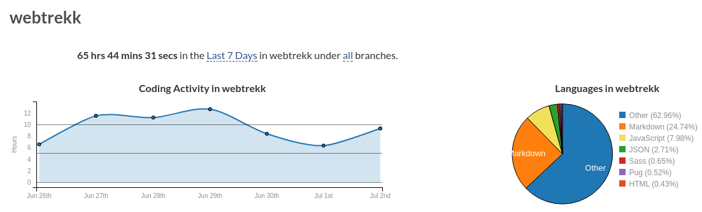

# Webtrekk AngularJS Demo by Joehannes

## Introduction

I chose literate programming, because
* proper documentation was requested in the first place
* it's a decent way to code and document at the same time
* one can easily combine packages of files which belong together into one story-chapter
* wanted to try that out for a long time anyway

The only drawback from writing markdown with many files combined into story-chapters
is the lack of proper eslint-integration, at least as of now in my editor of choice (Atom)
and to my best knowledge.
Should you get it working somehow properly, let me know ...
I filed an issue on [github](https://github.com/eslint/eslint-plugin-markdown/issues/74) :)

One more thing to be aware of is, that I used my own angular-js lib with this project.
I wrote it and think it's a decent piece of helper software.
It let's you write angularjs in the style of angular.

You'll see. The lib can be found on [github](http://www.github.com/ng-harmony)

## Gist

The task was a relatively easy one as I came prepared
* I already had used RxDB as a localStorage in another project
* I haven't used bootstrap for a long time, but it's straightforward methinks
* I got my lib ready to use and I just like coding that way

I like to create angular-like a Page-Component/Controller for (kinda) each route,
kinda a container. All structure that seems reusable gets component-encapsulated.

Also, I like to create the visual (html) structure first, as it seems to give me a bigger picture of things.

## Timetracking

It took me longer than anticipated, which is mainly due to my setup.
* I started almost completely from scratch (copied a webpack config)
* I used a the literate programming approach and it took me some time get things running
* I had some additional trouble with webpack and the dev server ...

Apart from that, I'm very happy to present a decent solution and after you didn't have to
wait a long time for the solution as the weekend came in handy :)

If you want to check out what time I spent on what, I kindly refer you to [wakatime](https://wakatime.com/@joehannes/projects/mlugtebunv?start=2017-06-26&end=2017-07-02),
which I got integrated in my Code-Editor and Browser.



## Further Reading and Implementation Details

Please navigate to the literature folder and find markdown files, nicely readable with
your favorite markdown-viewer or on github.

Happy reading :) Cheers, [Joehannes](maito:johannes.neugschwentner@gmail.com)


PS:

* npm start <- webpack dev server
* npm test <- run the tests
* npm run build <- deploy to dist dir ... I had to manually adjust index.html

# Requirements

## An AngularJS/LocalStorage/Bootstrap Demo

Create a Single Page Application to edit user data based on local storage (no backend).

### General requirements:

* Implemented in JavaScript using Angular.js, HTML/CSS (Bootstrap), with JavaScript tests implemented using Jasmine
* Runs in the latest version of Chrome, Firefox and Internet Explorer
* Contains documentation (in the code)
* Contatains at least one test for every controller

### Specification:

* The application starts with an Overview page listing all customers
* It contains a „Customer Detail View" to create a customer and edit his profile data.
* It contains a „Navigation Data View" that shows tracking data of the customer.
* The data is stored in local storage
* Initially (if the local storage is empty), it shall be initialised with the data from Appendix 1 "Master Data Table" and "Navigation Data Table"

## Screens

### Overview (Initial Screen)

* Sort by "First Name" or "Last Name" by clicking on the column heading (first click: ascending,second click: descending)
* Initially sorted by "Last Name", ascending
* Optionally show the sort direction in the table heading
* "Age" is calculated from the birth date
* "Add New Customer" button goes to the "Add New Customer" view
* "Edit" goes to the "Customer Detail" view
* "Delete" deletes the customer (without asking)
* "Navi" goes to the "Navigation Data" view


### Customer Details View

* Customer ID is not editable
* "Save" saves the data, "Cancel" does not save anything, both go back to the Overview


### Navigation Data View

* Sort by page name or timestamp by clicking on the column heading (first click: ascending, second click: descending)
* Initially sort by "Timestamp", ascending
* Optionally show the sort direction in the table heading


### Appendix

* Initial Customer Data Load

```json

	[{
		"customer_id": 1,
		"first_name": "Peter",
		"last_name": "Smith",
		"birthday": "1996-10-12",
		"gender": "m",
		"last_contact": "2013-06-01",
		"customer_lifetime_value": 191.12
	},{
		"customer_id": 2,
		"first_name": "Anna",
		"last_name": "Hopp",
		"birthday": "1987-05-03",
		"gender": "w",
		"last_contact": "2013-07-08",
		"customer_lifetime_value": 50.99
	},{
		"customer_id": 3,
		"first_name": "Christian",
		"last_name": "Cox",
		"birthday": "1991-02-21",
		"gender": "m",
		"last_contact": "2013-08-01",
		"customer_lifetime_value": 0
	},{
		"customer_id": 4,
		"first_name": "Roxy",
		"last_name": "Fox",
		"birthday": "1979-06-30",
		"gender": "w",
		"last_contact": "2012-01-29",
		"customer_lifetime_value": 213.12
	},{
		"customer_id": 5,
		"first_name": "Eric",
		"last_name": "Adam",
		"birthday": "1969-11-21",
		"gender": "m",
		"last_contact": "2013-03-18",
		"customer_lifetime_value": 1019.91
	}]

```

* Navigation Data Table

```json

	[{
		"customer_id": 1,
		"pages": "A",
		"timestamp": "2013-­06-01 10:10:12"
	},{
		"customer_id": 1,
		"pages": "B",
		"timestamp": "2013-06-01 10:11:12"
	},{
		"customer_id": 1,
		"pages": "A",
		"timestamp": "2013-06-01 10:12:12"
	},{
		"customer_id": 2,
		"pages": "C",
		"timestamp": "2013-07-08 09:03:09"
	},{
		"customer_id": 2,
		"pages": "A",
		"timestamp": "2013-07-08 09:09:09"
	},{
		"customer_id": 2,
		"pages": "D",
		"timestamp": "2013-07-08 09:19:09"
	},{
		"customer_id": 3,
		"pages": "B",
		"timestamp": "2013-07-08 09:19:09"
	},{
		"customer_id": 3,
		"pages": "A",
		"timestamp": "2013-07-08 09:19:10"
	},{
		"customer_id": 4,
		"pages": "D",
		"timestamp": "2013-07-08 09:19:11"
	},{
		"customer_id": 4,
		"pages": "A",
		"timestamp": "2013-07-08 09:19:12"
	},{
		"customer_id": 5,
		"pages": "X",
		"timestamp": "2013-07-08 09:19:13"
	},{
		"customer_id": 5,
		"pages": "A",
		"timestamp": "2013-07-08 09:19:14"
	},{
		"customer_id": 5,
		"pages": "B",
		"timestamp": "2013-07-08 09:19:15"
	}]

```
